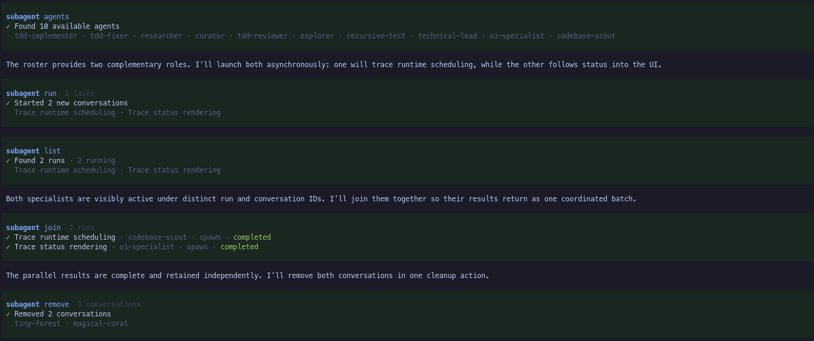

# @pi9/subagent

Delegate focused work from Pi to context-isolated child conversations with a single `subagent` tool. It supports foreground and background dispatch, retained follow-up conversations, recursive delegation, live progress, and tree-wide concurrency limits.



## Feature overview

- **Retained conversations** let the parent send follow-ups to a successful child while preserving its accumulated context.
- **Background dispatch** returns session handles immediately so the parent can continue working, with configurable completion notifications and nonblocking result retrieval.
- **Recursive delegation** lets subagents spawn their own children under one tree-wide concurrency limit.
- **Live progress** shows status, token usage, tool activity, recursive children, and answers in the tool row, with persistent work tracked in the Background and Retained widget sections.
- **Unified session management** provides filterable flat and tree views, live conversations, agent discovery and launch, cleanup, and settings through `/subagents`.
- **Focused tool actions** separate agent discovery, session inventory, dispatch, result retrieval, and cleanup without adding multiple tools to the parent context.

## Install

```bash
pi install npm:@pi9/subagent
```

## Quick start

Define an agent in `.pi/agents/scout.md`:

```markdown
---
name: scout
description: Read-only codebase reconnaissance
model: anthropic/claude-sonnet-4
tools: read, bash
retainConversation: true
---

Inspect the repository and return concise, evidence-backed findings.
```

Then delegate to it:

```ts
subagent({
  action: "run",
  tasks: [{ agent: "scout", label: "auth map", prompt: "Find the auth entry points." }]
})
```

Foreground dispatch waits and returns settled results. To continue the same retained conversation, use its handle; the spawn policy and label remain fixed:

```ts
subagent({
  action: "run",
  tasks: [{ sessionId: "quiet-otter", prompt: "Turn those findings into an implementation plan." }]
})
```

## Define agents

Agent markdown is discovered from installed Pi packages, the user `${PI_AGENT_DIR ?? ~/.pi/agent}/agents` directory, and the nearest project `.pi/agents`. Package definitions are loaded first, then user/project definitions; effective precedence is project > user > package by default.

Installed packages declare agent directories with Pi's standard manifest field:

```json
{ "pi": { "agents": ["./agents"] } }
```

Each path is resolved relative to the package root. Declared package directories are scanned recursively for agent Markdown; `*.chain.md` files are excluded. Invalid manifests, declarations, and missing paths are ignored so other definitions can still load.

| Frontmatter | Required | Meaning |
| --- | --- | --- |
| `name` | yes | Runtime agent name. |
| `description` | yes | Non-blank discovery summary. |
| `model` | no | `provider/model` or an unambiguous model id. |
| `thinking` | no | `off`, `minimal`, `low`, `medium`, `high`, `xhigh`, or `max`. |
| `tools` | no | Comma-separated allowlist; include `subagent` for recursive delegation. |
| `skills` | no | Comma-separated default skills. A spawn-task value replaces this list. |
| `retainConversation` | no | Retain the process-local child conversation for successful follow-ups. |

The body becomes the child system prompt. `retainConversation` resolves once at spawn into an immutable `retain` or `release` conversation policy. A resume task accepts only `sessionId` and `prompt`: it cannot change the policy, label, model, thinking, working directory, or skills.

## Dispatch and attempts

Every invocation is represented as an attempt with immutable `kind` (`spawn` or `resume`), `dispatch` (`foreground` or `background`), and prompt. Dispatch belongs to the attempt, so a conversation can have foreground and background attempts without rewriting its history.

Background dispatch returns handles immediately:

```ts
subagent({
  action: "run",
  dispatch: "background",
  tasks: [{ agent: "scout", label: "auth map", prompt: "Map auth code." }]
})
```

Use `list` for lightweight status, `results` for full output, and `remove` for cleanup. A background attempt retains its latest result until removal or a later attempt supersedes it, but result retention alone does not make its conversation available for resume. `backgroundNotify` controls completion notification: `auto`, `steer`, or `none`.

Only a successfully completed, available conversation can resume. A failure before conversation binding preserves the prior successful conversation; errors, aborts, or interruptions after binding do not.

## Retention and conversations

Retention is centralized and reports why an agent remains cataloged. Active work, background results, and `retainConversation` policy independently govern inventory, conversation availability, and capabilities. Conversations are process-local and are not restored after restart or extension reload.

## `/subagents` UI

`/subagents` opens a unified overlay with Sessions, Agents, and Settings pages; `/subagents sessions`, `/subagents agents`, and `/subagents settings` open a page directly.

Sessions can be filtered and switched between flat and tree views. Tree view nests running descendants under their parents while retained terminal sessions stay at the root. From Sessions, stop active work, remove terminal entries, or press Enter on a running or resumable session to open its full-width conversation. Messages steer a running session directly; messages to a successfully completed retained session start a tracked follow-up attempt.

The Agents page filters discovered definitions and can launch a selected agent in the background after prompting for its task.

## Live display

The tool row shows each child's state, label, tools, tokens, elapsed time, recursive children, and answer. Previous Run sections carry their own attempt kind and dispatch.

The persistent widget separates **Background** work and other **Retained** sessions. Background attempts stay in the Background section while active or holding a result; persistent non-background sessions appear under Retained. Transient foreground work remains in the tool row, with an optional running count in the widget footer. Configure `widgetPlacement` (`belowEditor`, `aboveEditor`, `off`) and `widgetLayout` (`auto`, `columns`, `stacked`).

## Settings

Settings are stored at `${PI_AGENT_DIR ?? ~/.pi/agent}/subagent/settings.json`:

```json
{
  "runtime": {
    "maxTasksPerRun": 8,
    "maxConcurrentSubagents": 4,
    "defaultRetainConversation": false,
    "backgroundNotify": "auto"
  }
}
```

`defaultRetainConversation` applies only when an agent definition omits `retainConversation`; a spawn task may override the resolved definition. Concurrency is shared across the entire recursive tree. Discovery and display settings are also available, while common runtime and widget controls are exposed by `/subagents settings`.

## Tool actions

| Action | Behavior |
| --- | --- |
| `agents` | Discover definitions and their resolved defaults. |
| `list` | Return lightweight identity, status, attempt, conversation, retention, and capability fields, optionally filtered by status. |
| `run` | Spawn with `agent` or resume with `sessionId`; `dispatch` selects foreground or background for the whole invocation. |
| `results` | Nonblocking retrieval of full output/error by `sessionIds`; `remove: true` atomically collects and removes terminal entries. |
| `remove` | Abort running entries or discard queued/retained entries by `sessionIds`. |

Spawn tasks require `agent`, `label`, and `prompt`, and may set `model`, `thinking`, `cwd`, `skills`, and `retainConversation`. Resume tasks contain `sessionId` and `prompt` only. Unknown or unreadable skills fail before child startup.

A snapshot projects lifecycle state structurally:

```ts
{
  attempt: { kind: "spawn" | "resume", dispatch: "foreground" | "background" },
  conversation: { policy: "retain" | "release", available: boolean },
  retention: { catalog: "transient" | "persistent", reasons: RetentionReason[] },
  capabilities: { canResume: boolean, canRemove: boolean }
}
```

Previous runs contain their own `attempt`. Settled agent results expose `kind`, `dispatch`, `canResume`, and `retentionReasons`; `sessionId` is exposed only while the agent remains cataloged. `canRemove` is the safe interactive capability for terminal cataloged entries; an explicit remove can still stop queued or running work.

## Breaking contract

This lifecycle release has no migration layer, compatibility aliases, or compatibility projections. The legacy `resumable` field is rejected in both task input and agent frontmatter; callers must use `retainConversation` and adopt the current attempt, snapshot, result, and capability contracts directly. The old settings key `runtime.defaultResumable` is ignored rather than migrated, so when `runtime.defaultRetainConversation` is absent its new default of `false` applies.

## Events and persistence

The package emits `subagent:updated`, `subagent:queued`, `subagent:started`, and `subagent:completed`. Terminal attempt metadata is appended to the Pi session log, but child conversations are process-local. Switching or forking while work is queued or running asks for confirmation.

## Architecture

- `src/domain/` owns agents, attempts, the single retention decision, snapshots, and results.
- `src/runtime/` owns orchestration, queues, groups, notifications, and child sessions.
- `src/tool/` owns action handlers and child tool injection.
- `src/command/`, `src/ui/`, and `src/view/` own the overlay, Retained widget, and rendering.
