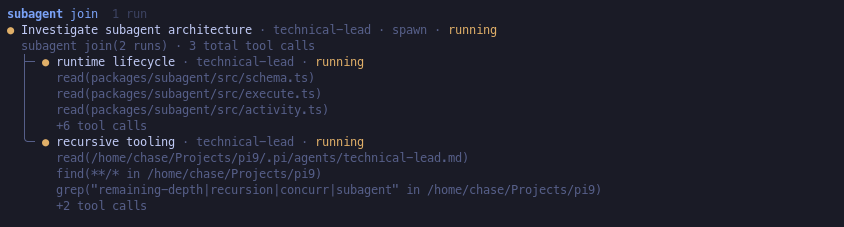

# @pi9/subagent

Delegate focused work from Pi to context-isolated child conversations. The single `subagent` tool provides agent discovery, side-effect-free inventory, asynchronous runs, blocking retrieval, explicit cleanup, recursive delegation, and live progress.


## Feature overview

- **Retained conversations** preserve child context for follow-up runs until the parent explicitly removes the conversation.
- **Asynchronous runs and exact joins** let the parent continue working after dispatch, then wait for and retrieve specific runs by ID.
- **Recursive delegation** lets subagents spawn and join their own descendants under tree-wide ownership and concurrency rules.
- **Live progress** shows queued and running work, recent tool activity, recursive children, and completed answers in tool and widget views.
- **Unified conversation management** provides live status, completed output, follow-up prompts, agent discovery, cleanup, and settings through `/subagents`.
- **Focused tool actions** separate agent discovery, side-effect-free inventory, task execution, blocking retrieval, and cleanup without adding multiple tools to the parent context.
- **Minimal tool prompt size** keeps delegation overhead low and reduces context bloat in the parent conversation.

## Install

```bash
pi install npm:@pi9/subagent
```

## Define agents

Agent markdown is discovered from Pi-managed packages, the user `${PI_AGENT_DIR ?? ~/.pi/agent}/agents` directory, and the nearest project `.pi/agents`. Packages declare recursive agent directories with the standard `pi.agents` array in `package.json` (for example, `"pi": { "agents": ["./agents"] }`). Project definitions override same-named user and package definitions by default; user definitions override package definitions.

For example, `.pi/agents/scout.md` defines a project-local read-only agent:

```markdown
---
name: scout
description: Read-only codebase reconnaissance
model: anthropic/claude-sonnet-4
tools: read, bash
---

Inspect the repository and return concise, evidence-backed findings.
```

| Frontmatter | Required | Meaning |
| --- | --- | --- |
| `name` | yes | Runtime agent name. |
| `description` | yes | Non-blank discovery summary. |
| `model` | no | `provider/model` or an unambiguous model id. |
| `thinking` | no | `off`, `minimal`, `low`, `medium`, `high`, `xhigh`, or `max`. |
| `tools` | no | Comma-separated allowlist; include `subagent` for recursive delegation. |
| `skills` | no | Comma-separated default skills. A spawn-task value replaces this list. |

The body becomes the child system prompt. Spawn tasks require `agent` and `prompt`; `label` is optional, and tasks may override supported execution options such as model, thinking, working directory, and skills. A model requested by either the task or agent definition must resolve; an unknown or malformed value fails that task instead of falling back. When neither specifies a model, the child inherits the parent's model. An explicit task `cwd` is resolved relative to the parent's working directory and must identify an existing directory. Follow-up tasks identify a conversation and provide a prompt; the conversation's agent and execution context remain fixed.

## Tool actions

| Action | Behavior |
| --- | --- |
| `agents` | Discover agent definitions and their resolved defaults. |
| `list` | Return a lightweight inventory of conversations and runs without run output. It is pure: it acknowledges nothing and changes no lifecycle state. |
| `run` | Start one or more well-formed tasks asynchronously and return one ordered outcome per task, including identifiers for accepted tasks and errors for semantic or startup failures. |
| `join` | Block until every explicitly requested exact run settles, then return and acknowledge exactly those runs. There is no timeout. Cancelling `join` stops only the wait; it does not stop the underlying runs. |
| `remove` | Clean up the specified conversations, aborting active work if necessary, deleting resumable child session state, and hiding them from `list`. |

Parallel runs stream their current status and recent tool activity independently:


Each task is handled independently after the tool call passes SDK schema validation. Task-level parsing and startup failures—such as a missing agent, an unknown agent, an invalid model, or a missing working directory—return an ordered `{ ok: false, inputIndex, error }` outcome without preventing valid sibling tasks from starting. Invalid outer invocations—including a missing or unknown action, absent or empty tasks, and batch-limit violations—remain global errors. Provider-level schema violations may reject the tool call before execution.

For example, a three-task batch can return a successful start, a task-level failure, and another successful start in input order:

```json
[
  { "ok": true, "inputIndex": 0, "conversationId": "quiet-otter", "runId": "search-boldly" },
  { "ok": false, "inputIndex": 1, "error": "Task must carry exactly one of agent (spawn) or conversationId (resume)." },
  { "ok": true, "inputIndex": 2, "conversationId": "calm-fox", "runId": "inspect-carefully" }
]
```

Rejected tasks receive no `conversationId` or `runId` and do not appear in `list`; only accepted tasks enter the run lifecycle.

A run belongs to one conversation. Spawning creates both; a follow-up creates another run in an existing conversation. Every conversation remains available in the runtime inventory until explicitly removed, including after successful, failed, or interrupted work.

`canResume` becomes true only after a completed run or an interrupted run that preserved its conversation context. It remains false while work is queued or active, and after failures or interruptions that did not preserve context.

`join` is keyed by `runId`, not merely by conversation. A root/top-level join waits for, returns, and acknowledges exactly the requested runs, even when one of their conversations has newer work. A join issued by a child may target only runs spawned anywhere beneath that child's exact owner run; sibling, ancestor, and unrelated runs are rejected.

Only descendants named in an explicit nested join block that caller. Unjoined descendants continue independently and detach when their parent finishes. Nested answers are returned directly to the child that joined them, but their output is omitted from ancestor tree rendering; ancestor views retain lifecycle and identity context without copying target answers. Nested join-attempt history is runtime-local and is not restored after restart or extension reload.



After `remove`, compact terminal run results remain joinable by `runId`, including the aborted result of work that was active when removed, even though the conversation and resumable session state are gone. Use `remove` with conversation identifiers when the whole conversation is no longer needed.

## Capacity and concurrency

Concurrency is shared across the entire recursive delegation tree. `maxConversations` defaults to `100`. Once that many conversations are present, new spawns are rejected until one or more conversations are removed; existing conversations can still be inspected, joined, or cleaned up.

Settings are stored at `${PI_AGENT_DIR ?? ~/.pi/agent}/subagent/settings.json`. The widget defaults to **summary** mode, a one-line count of running, queued, and all retained conversations; **progress** mode instead shows active queued/running rows and respects the `Progress rows` limit in `/subagents settings`. Retained conversations remain counted after they settle until explicit `remove`. Existing `widgetLayout: "columns"` or `"stacked"` settings migrate to progress mode, while `"auto"` (or no legacy value) becomes summary; saved settings use `widgetMode`.

## Notifications, UI, and lifecycle

Completion notifications concern settled runs that have not yet been acknowledged. Listing inventory does not acknowledge them. Joining a run acknowledges that exact run; cleanup also clears notifications associated with the removed conversations.

`/subagents` opens the conversation, agent, and settings UI. It provides live status and progress, access to completed output, follow-up prompts when `canResume` is true, and explicit conversation cleanup.

The package emits lifecycle updates for queued, started, and completed work. Nested join changes emit `subagent:updated` with `kind: "nestedJoin"` and the owner conversation snapshot; they do not create additional queued, started, or completed milestones. Identifiers, run records, child conversation context, and nested join-attempt history are runtime-local only. They are not restored after a process restart or extension reload.

`run` remains asynchronous regardless of recursive delegation. These join semantics do not change the scope or behavior of `/subagents` or its widget.

## Major-version migration

There is no compatibility layer for the previous lifecycle API.

| Previous term or behavior | New contract |
| --- | --- |
| `foreground` / `background` dispatch | `run` always starts asynchronously; use `join` when blocking retrieval is needed. |
| `results` action | `join` waits for and retrieves an exact run. |
| `sessionId` | Use `conversationId` for conversation lifecycle and `runId` for exact-run retrieval. |
| `retainConversation` | Every conversation remains in the runtime until explicit `remove`. |
| `widgetLayout` | Use `widgetMode`: legacy `columns`/`stacked` becomes `progress`; `auto` becomes the default `summary`. |

## Architecture

- `src/agents.ts` owns agent definitions, discovery, parsing, and requested configuration.
- `src/conversation.ts` and `src/activity.ts` own persistent conversations, exact runs, lifecycle state, and live SDK activity.
- `src/runtime.ts` owns the conversation catalog, joining, scheduling, queue limits, and retained run results; `src/execute.ts` owns child SDK session execution.
- `src/schema.ts` and `src/tool.ts` own provider-facing validation and tool actions.
- `src/notifications.ts`, `src/widget.ts`, and `src/command/` own the three user-facing presentation surfaces.
- `src/settings.ts`, `src/identifiers.ts`, and `src/index.ts` own configuration, runtime-local identifiers, and Pi extension composition respectively.
